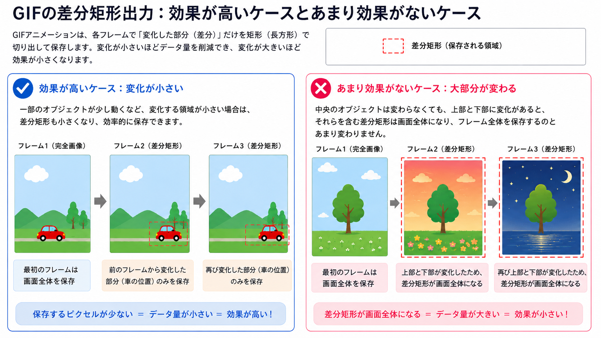
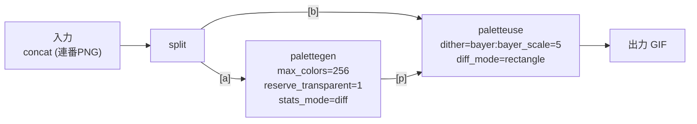

# GIF / 画像 / 動画 / ffmpeg について

Rustのコードではなく、主にドメイン知識についてまとめたファイル

## GIFの構造

### 概要

一言で言うとパラパラ漫画

delay間隔などを含めた1つの画像を1フレームと呼ぶ

- 複数の画像をリストで扱う
- 各画像をアニメーションするdelay間隔がある
- 全画像で共通の表示領域サイズのcanvasがある

フレームとGIFのデータ形式は以下

```rust
// フレーム(画像)
pub struct GifFrame {
    pub pixels: Vec<u8>,
    pub width: u16,
    pub height: u16,
    pub left: u16,
    pub top: u16,
    pub delay: u16,
    pub dispose: gif::DisposalMethod,
}

// GIF
pub struct GifFile {
    frames: Vec<GifFrame>,
    pub canvas_width: u16,
    pub canvas_height: u16,
}
```

### Disposal Method

- Disposalの種類に応じてGIF Exportする際のFrame処理を分岐することができる
  - 本アプリでは差分矩形出力するために利用
- 具体的には次のFrameを描く前の前処理

| Disposal   | Frame表示後の処理          | Rustでの実装                                         |
| ---------- | -------------------------- | ---------------------------------------------------- |
| Keep       | 特になし                   | 現状は特になし                                       |
| Background | フレームをクリアして透明化 | RGBAを全て0 (透明) でリセット                        |
| Previous   | 前のフレームの状態に戻す   | 前のFrameをcloneしておき、それで次のフレームを初期化 |

- Backgroundで毎フレームリセットして表示するGIFが多い
- Previousはエフェクトのような特殊なフレームの場合に利用

### 差分矩形

GIFは画像の連番であり、四角い必要がある

そのため、完全な差分ではなく 差分 **矩形** でしか扱えない

- 背景が動かず、車が動く
  - 効果がある
- 背景が動き、木が動かない
  - 効果がない



Disposal MethodがKeepの場合は、差分矩形処理を実装することでファイルサイズを小さくすることが可能

自前実装は複雑なため、ffmpegで実装することにした

```
フレームN と フレームN+1 を比較
       ↓
変化したピクセルの最小矩形を計算 (Frameごとにサイズを最小化)
       ↓
その矩形だけのピクセルデータを切り出す
       ↓
frame.left, top, width, height に設定して書き出す
       ↓
disposal は Keep に設定 (NとN+1フレームで比較可能にするため、前フレームを残せるkeepにする)
```

## 画像の構造

### 概要

以下のようなデータ構造

```rust
pub struct ImageBuffer {
    width: u32,
    height: u32,
    pixels: Vec<u8>,
}
```

- Rustでは **1次元配列** である
- 画像サイズに応じて各RGBのサイズが均等に大きくなる
- 本アプリでは `255` までの `RGB8` を利用
- `RGB` 画像の場合は、`3bytes` ごとに区切った1次元配列と考えて処理する
- `RGBA8` 画像の場合は、アルファチャネル(透明度)が加わった `4bytes` となる
- この3bytesや4bytesなどの画像の最小単位を `1Pixel` と呼ぶ

GIFではcanvasでleft, top分ズラして画像を表示する仕組みのため、直接vecをループせずrow, colベースで分けてループさせる必要がある

以下、`RGB (3bytes)` 画像の場合の1次元配列

```
[255, 0, 0,   0, 255, 0,   0, 0, 255,   255, 255, 0]
 ↑(0,0)赤     ↑(1,0)緑     ↑(0,1)青      ↑(1,1)黄
```

2x2画像の場合は以下のような並び順となる

```
1行目: (0,0)赤  (1,0)緑
2行目: (0,1)青  (1,1)黄
```

RGB16の方が色を細かく調整できるが、その分サイズが大きくなる

```
RGB8  (u8)  → 0〜255    (256段階)
RGB16 (u16) → 0〜65535  (65536段階)
```

## Image Crate

外部ライブラリのImage Createの設定項目をベースに簡単にまとめる

### Pixel types

| image crate 対応 | 形式    | チャンネル               | 用途                     |
| ---------------- | ------- | ------------------------ | ------------------------ |
| ○                | Luma    | 輝度のみ                 | グレースケール画像       |
| ○                | LumaA   | 輝度 + アルファ          | グレースケール画像       |
| ○                | RGB     | 赤・緑・青               | 一般的な画像             |
| ○                | RGBA    | 赤・緑・青・アルファ     | 透明度あり画像           |
| △                | CMYK    | シアン・マゼンタ・黄・黒 | 印刷用途                 |
| ×                | HSV/HSL | 色相・彩度・明度         | 色選択 UI など           |
| ○                | Rgb32F  | 浮動小数点 RGB           | 高ダイナミックレンジ画像 |

### Image Types

| 本プロジェクトでの利用 | 型           | 用途                                                                                                                            |
| ---------------------- | ------------ | ------------------------------------------------------------------------------------------------------------------------------- |
| ○                      | ImageBuffer  | Pixel typesを固定した画像。RGBA8 バイト列から直接生成でき、PNG/JPEG 等の出力処理で使用                                          |
| ×                      | DynamicImage | 実行時にPixel typesが決まる画像。ファイルを開く際に使うが、このプロジェクトは gif クレートでGIFを読み込むと決まっているため不要 |


### Image Operations

画像を操作する関数群は、レベル別に以下のように分類される

| レベル              | トレイト/モジュール | 内容                                  |
| ------------------- | ------------------- | ------------------------------------- |
| 低レベル (読み取り) | GenericImageView    | ピクセル単位の読み取り                |
| 低レベル (読み書き) | GenericImage        | ピクセル単位の読み書き                |
| 高レベル            | imageops            | GenericImage を土台にした画像編集機能 |

#### GenericImageView

| メソッド名     | 用途                     |
| -------------- | ------------------------ |
| width / height | 幅・高さ取得             |
| get_pixel      | 指定座標のピクセルを取得 |
| view           | 部分ビューを取得         |

#### GenericImage

| メソッド名  | 用途                         |
| ----------- | ---------------------------- |
| put_pixel   | 指定座標にピクセルを書き込む |
| blend_pixel | アルファブレンドして書き込む |
| copy_from   | 別の画像を指定位置にコピー   |

#### imageops

| 関数名                     | 用途                 |
| -------------------------- | -------------------- |
| resize                     | サイズ変更           |
| crop                       | 部分切り出し         |
| rotate90 / 180 / 270       | 回転                 |
| flip_horizontal / vertical | 反転                 |
| grayscale                  | グレースケール化     |
| brighten                   | 明るさ調整           |
| contrast                   | コントラスト調整     |
| huerotate                  | 色相回転             |
| invert                     | 色反転               |
| blur                       | ぼかし               |
| filter3x3                  | 3x3 カーネルフィルタ |

##### FilterType (imageops::resize の補間方式)

| FilterType | 補間方式                | 画質                         | 速度 (参考値)    |
| ---------- | ----------------------- | ---------------------------- | ---------------- |
| Nearest    | 最近傍法                | 最も低い (ジャギー)          | 最速 (約31ms)    |
| Triangle   | 線形補間 (Bilinear相当) | やや良い、若干ぼやける       | 速い (約414ms)   |
| CatmullRom | 三次補間 (Bicubic相当)  | 良い、エッジが比較的シャープ | 中程度 (約817ms) |
| Gaussian   | ガウシアンフィルタ      | 高品質だがやや柔らかい       | 遅い (約1180ms)  |
| Lanczos3   | Lanczos法 (窓幅3)       | 最も高品質、シャープ         | 遅い (約1170ms)  |

このプロジェクトではキャンバスリサイズ時にFilterTypeをUIから選択可能にしている (デフォルト: Lanczos3)

## その他 画像について

### JPEG

PNG, JPEGなどのFormatは、Pixel (RGB等) をBytesとしてシリアライズ、圧縮する規格

- PNG: RGB, RGBA, Gray+Alpha, Indexedなど多くのPixel形式を `可逆圧縮 (lossless)` でサポート
- GIF: Indexed (256色) のみ。1色を透過色として指定可能
- JPEG: alphaが規格に存在しなく `非可逆圧縮 (lossy)`

#### lossless / lossy

画像は圧縮して軽量化されて保存されるが、表示する際は復元する仕組みとなっている

- lossless: 圧縮して保存、表示する際は完全に復元して表示
- lossy: 品質を落として (情報を捨てて) 圧縮して保存、表示する際は復元するが、そもそも一部の情報を捨てて軽量化しているため、完全な復元はできていない
  - 100 → 70: ファイルサイズは大きく減るのに、見た目はほぼ変わらない (「お得」な領域)
  - 70 → 20: ファイルサイズはあまり減らないのに、見た目の劣化はどんどん進む (「損」な領域)

多くのアプリでは、JPEGのデフォルト品質を75〜85付近にして「お得」な領域で設定している

「品質100が一番きれい」なのは当然だが、「品質90と100はほぼ同じに見えるのにファイルサイズは全然違う」「品質50は品質90よりちょっと小さいだけなのに、見た目はかなり違う」ということが起こる

ざっくり、JPEGの品質は、データを圧縮しやすいような形式に四捨五入すること

データサイズ (Bytes数) を削るわけではなく、圧縮率を高くするための事前作業

### ファイルサイズ軽量化

| フォーマット                  | 解像度を下げる          | 色数を減らす                           | 品質 (quality) を下げる      | その他の手段                 |
| ----------------------------- | ----------------------- | -------------------------------------- | ---------------------------- | ---------------------------- |
| PNG                           | ◎ 効果大                | ◎ 効果大 (パレット化)                  | ✕ 概念なし                   | 圧縮レベル (効果は小さい)    |
| JPEG                          | ◎ 効果大                | - (常にフルカラー扱い)                 | ◎ 効果大                     | クロマサブサンプリング       |
| GIF                           | ◎ 効果大                | ◯ (256色上限をさらに減色)              | ✕ 概念なし                   | フレーム数・再生時間を減らす |
| WebP (このプロジェクトの実装) | ◎ 効果大                | ◎ 効果大 (lossless専用なのでPNGと同様) | ✕ このプロジェクトでは非対応 | -                            |
| AVIF                          | ◎ 効果大                | -                                      | ◯ 技術的には対応可能         | -                            |
| BMP                           | ◎ 効果大 (これしかない) | △ (ビット深度を下げる)                 | ✕ 無圧縮形式                 | -                            |
| ICO                           | ◯ (1〜256pxの制約あり)  | △                                      | 内部形式 (PNG/BMP) 依存      | -                            |

- 「解像度を下げる」は、全フォーマットに共通して有効 (圧縮方式に関わらず元データ自体が減るため)
- 「品質」が効くのは、JPEG/AVIFのみ。これらは非可逆圧縮のため
- 「色数を減らす」が効くのは、PNG/GIF/WebPなど、パレット形式や色情報をそのまま圧縮するフォーマット。JPEGはYCbCr変換するため「色数」という概念が当てはまらない
- このプロジェクトはGIFエディタのため、「GIFのフレーム数」が画質を一切落とさずにファイルサイズを大きく削減できる手段として特に有効

### DPI / PPI (JpegEncoder::set_pixel_density)

- DPI: Dots Per Inch (1インチあたりのドット数) の略。元々は印刷業界の単位
- PPI: Pixels Per Inch。デジタル画像ではこちらが厳密だが、慣習的にDPIと呼ばれることが多い
- ピクセル数 (width/height) だけでは「現実世界での大きさ」が決まらないため、`物理サイズ = ピクセル数 ÷ DPI` という形で印刷時のスケールを表すメタデータとして使われる
- ブラウザや画像ビューアでの表示では無視され、常にピクセル等倍 (またはデバイスピクセル基準) で表示される。Office系アプリへの貼り付けや印刷時にのみ参照される
- 値を変えてもファイルサイズは変わらない (JFIF APP0セグメントは固定長で、中の数値が変わるだけ)

このプロジェクトは画面表示用のため `set_pixel_density` は設定せず、デフォルト (DPI未指定/アスペクト比1:1) のまま出力する

## 動画の構造

`Container Format` であり、`Video Codec` + `Audio Codec` で構成

Container、 Video、 Audioそれぞれに規格があり、組み合わせられている

同じContainer FormatでもVideoやAudioのCodecが異なることがある

| Container Format | Video Codec  | Audio Codec | 用途・特徴                                                  |
| ---------------- | ------------ | ----------- | ----------------------------------------------------------- |
| MP4              | H.264 (AVC)  | AAC         | 最も標準的な組み合わせ。Web、スマホ、PCなど幅広い互換性     |
| MP4              | H.265 (HEVC) | AAC         | 4K/8K配信、iPhoneの高効率撮影など。高圧縮率                 |
| MP4              | AV1          | Opus        | 最新のWeb配信(YouTube等)。ロイヤリティフリーで高効率        |
| MP4              | ProRes       | PCM         | Appleが開発した編集用コーデック。高画質だがデータ量が大きい |

そのため、全ての規格に対応させるには、`FFmpeg` を利用することが一般的

## ffmpeg

### トランスコード処理

ffmpegの処理の流れ: `demux → decode → (filter等) → encode → mux`

| 用語                        | 入力                                | 出力                                      | 役割                                                                  |
| --------------------------- | ----------------------------------- | ----------------------------------------- | --------------------------------------------------------------------- |
| Demuxer (demultiplexerの略) | コンテナファイル/ストリーム全体     | パケット (圧縮済み、ストリームごとに分離) | コンテナの「箱」を解析し、映像/音声/字幕などのストリームに分解する    |
| Decoder                     | パケット (圧縮済み)                 | フレーム (生データ)                       | 圧縮されたデータを伸長し、実際のピクセル/音声サンプルに戻す           |
| Encoder                     | フレーム (生データ)                 | パケット (圧縮済み)                       | 生データを目的のコーデックで圧縮する                                  |
| Muxer (multiplexerの略)     | パケット (圧縮済み、複数ストリーム) | コンテナファイル/ストリーム全体           | 複数のストリームのパケットを束ね、1つのコンテナファイルとして書き出す |

### 参考リンク

- [Generic options](https://ffmpeg.org/ffmpeg.html#Generic-options)
- [concat](https://ffmpeg.org/ffmpeg-filters.html#concat)
- [concat manifest file syntax](https://ffmpeg.org/ffmpeg-formats.html#Syntax)
- [concat options](https://ffmpeg.org/ffmpeg-formats.html#Options)
- [gif demuxer options](https://ffmpeg.org/ffmpeg-formats.html#gif-1)
- [gif muxer options](https://ffmpeg.org/ffmpeg-formats.html#gif-2)
- [ffmpeg format (Demuxers/Muxers)](https://ffmpeg.org/ffmpeg-formats.html)
- [ffmpeg filter](https://ffmpeg.org/ffmpeg-filters.html)
  - `-filter_complex (-lavfi)`
  - `palettegen・paletteuse`

### オプション

```rust
.args(["-f", "concat"])   // ← -i の前 = 入力オプション
.args(["-safe", "0"])     // ← -i の前 = 入力オプション
.arg("-i")
.arg(manifest_path)
.args(["-fps_mode", "passthrough"])  // ← -i の後 = 出力オプション
.args(["-lavfi", "..."])             // ← -i の後 = 出力オプション
```

### filter_complex の構造 (spawn_gif_encoderの差分矩形出力)



## 画像を「すべて」で出力する際の `並行処理` のパフォーマンス計測

無制限平行はリスクがあるため、goroutineに相当するストリーミング平行で実装

1. 1枚ずつ逐次出力: 並行化なし
2. 全フレームを一度に並行出力: 同時実行数の制限なし
3. CPUコア数ごとチャンク分割して並行出力 (旧実装): 「Nコア分処理 → 完了待ち (バリア) → 次のNコア分」を繰り返す
4. 現在の実装: ストリーミング並行出力。1タスク完了ごとに次の1タスクを即座に投入し、常にCPUコア数分を並行実行 (バリアなし)

実行方法

```powershell
# GIFファイルのパスは環境変数 `TEST_GIF_PATH` で指定
$env:TEST_GIF_PATH = "C:\path\to\test.gif"
cargo test --release compare_export_strategies -- --ignored --nocapture
```

#### 結果例 (31フレーム、CPU論理コア数 = 8)

| 戦略                                  | 所要時間 |
| ------------------------------------- | -------- |
| 1. 1枚ずつ逐次出力                    | 48.49ms  |
| 2. 全フレーム並行出力 (無制限)        | 32.60ms  |
| 3. CPUコア数ごとチャンク並行 (旧実装) | 24.89ms  |
| 4. ストリーミング並行 (現在の実装)    | 24.53ms  |

#### 結果例 (221フレーム、CPU論理コア数 = 8)

| 戦略                                  | 所要時間 |
| ------------------------------------- | -------- |
| 1. 1枚ずつ逐次出力                    | 434.75ms |
| 2. 全フレーム並行出力 (無制限)        | 151.02ms |
| 3. CPUコア数ごとチャンク並行 (旧実装) | 312.99ms |
| 4. ストリーミング並行 (現在の実装)    | 231.03ms |

#### 出力が表示されない場合 (PowerShell)

ファイルにリダイレクトして確認

```powershell
cargo test --release compare_export_strategies -- --ignored --nocapture *> bench_output.txt
Get-Content bench_output.txt
```
