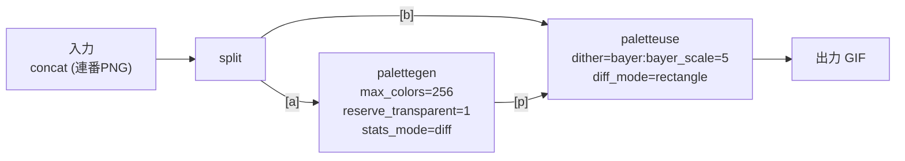

# やることリスト

- [svg](https://lucide.dev/icons/skip-forward)
- tracingでログ出力
- ICO出力: 幅・高さは1..=256の制約があるため、imageops::resizeでアスペクト比を保ったまま縮小
- 動画のストリーミング読み込みへの変更
- 他OSへの対応
  - focus window
  - open folder
  - ffmpeg binary
    - [windows 8.1 lgpl](https://github.com/BtbN/FFmpeg-Builds/releases/download/latest/ffmpeg-n8.1-latest-win64-lgpl-8.1.zip)

## Build

`resources/ffmpeg/ffmpeg.exe` はリポジトリにpushしていないため、ダウンロードして梱包してビルドすること

## Coding Rule

- UI側で有効な値のみRustに渡すようにする
  - Rust callback は「有効なインデックスを受け取って画像を表示する」という単一責任になる
  - "Make illegal states unrepresentable" の原則: Rust callback に無効なインデックスを渡せない構造にすると、防御的な else ブランチが不要になる

## GIF

- Imageのvec![]であり、アニメーション間隔のdelayなども含まれる
- 全フレーム共通の表示領域のサイズをcanvasと呼ぶ

```rust
// Image
pub struct GifFrame {
    pub pixels: Vec<u8>,
    pub width: u16,
    pub height: u16,
    pub left: u16,
    pub top: u16,
    pub delay: u16,
    pub dispose: gif::DisposalMethod, // アニメーション時に差分更新するための仕組み
}

// GIF
pub struct GifFile {
    frames: Vec<GifFrame>,
    pub canvas_width: u16,
    pub canvas_height: u16,
}
```

### Disposal Method

- Disposalの種類に応じてGIF Exportする際のFrame処理を分岐する必要がある
- 具体的には次のFrameを描く前の前処理

| Disposal   | Frame表示後の処理          | Rustでの実装                                         |
| ---------- | -------------------------- | ---------------------------------------------------- |
| Keep       | 特になし                   | 現状は特になし                                       |
| Background | フレームをクリアして透明化 | RGBAを全て0 (透明) でリセット                        |
| Previous   | 前のフレームの状態に戻す   | 前のFrameをcloneしておき、それで次のフレームを初期化 |

- Backgroundで毎フレームリセットして表示するGIFが多い
- Previousはエフェクトのような特殊なフレームの場合に利用

### 最適化 (そのうち実装すべきTODO)

Keepについて以下の処理を実装することでパフォーマンスを改善 (ファイルサイズを小さく) することが可能

フレームN と フレームN+1 を比較
       ↓
変化したピクセルの最小矩形を計算 (Frameごとにサイズを最小化)
       ↓
その矩形だけのピクセルデータを切り出す
       ↓
frame.left, top, width, height に設定して書き出す
       ↓
disposal は Keep に設定 (NとN+1フレームで比較可能にするため、前フレームを残せるkeepにする)

disposal は「前フレームをどう処理するか」の指示であり、差分フレームは Keep と組み合わせて初めて意味を持つ

上記自前実装は複雑なため、以下のffmpegで実装することにした

### ffmpeg差分最適化エクスポートの入力方式比較

軽量化そのものを行っているのはffmpeg側 (`diff_mode=rectangle`) であり、ここで比較しているのは「各フレームの可変delayをffmpegにどう渡すか」という入力方式の選択に過ぎない。入力方式自体がファイルサイズを縮小するわけではなく、選び方を誤るとffmpeg側の軽量化効果を阻害する (複製によるオーバーヘッド増加で悪化する) 点に注意

| 手法                                        | 一時ファイル | 軽量化効果への影響                             | 複雑度 | 評価                                                |
| ------------------------------------------- | ------------ | ---------------------------------------------- | ------ | --------------------------------------------------- |
| A. concat + 1フレーム1PNG + duration (採用) | 必要         | 阻害しない (実機確認: 元ファイルと同等サイズ)  | 低     | ◎ 採用                                              |
| B. rawvideo + stdin + フレーム複製 (旧実装) | 不要         | 阻害する (複製により最大7.5倍に悪化、実機確認) | 低     | × 不可                                              |
| C. image2 + `-ts_from_file` (mtime利用)     | 必要         | 阻害しない (Aと同等)                           | 中     | △ Aより間接的 (mtimeという別目的のメタデータを転用) |
| D. GCD単位の複製                            | 不要         | 部分的に軽減 (delay同士が互いに素だと効果なし) | 中     | △ 汎用性なし                                        |
| E. 名前付きパイプ                           | 実質不要     | 阻害しない (Aと同等)                           | 高     | △ 利益が小さい                                      |

なお`diff_mode=rectangle`自体は、不透明なコンテンツに対してのみ前フレームとの差分矩形を縮小する。透過を含むフレームは縮小されないが悪化もしない (実機確認済み)。UI側のスイッチラベルにも「不透明な内容のみ効果あり」と補足している

## Image

以下のようなデータ構造

```rust
pub struct ImageBuffer {
    width: u32,
    height: u32,
    pixels: Vec<u8>,
}
```

- rustの場合は1次元配列で、RGB画像の場合は、3bytesごとに以下のようなデータとなっている
- 画像サイズに応じて各RGBのサイズが均等に大きくなる
- 基本的には255までのRGB8を利用
- RGBA8はアルファチャネル(透明度)が加わった4bytes

[255, 0, 0,   0, 255, 0,   0, 0, 255,   255, 255, 0]  
 ↑(0,0)赤     ↑(1,0)緑    ↑(0,1)青     ↑(1,1)黄

2x2の場合は以下のような並び順となる  
1行目: (0,0)赤  (1,0)緑  
2行目: (0,1)青  (1,1)黄

u8  → 0〜255        （256段階）  
u16 → 0〜65535      （65536段階）

GIFではcanvasでleft, top分ズラして画像がされているため、コード内ではleft, top分ズラすため、直接vecをループせずrow, colベースでループさせている

### Pixel types

| image crate 対応 | 形式    | チャンネル               | 用途                     |
| ---------------- | ------- | ------------------------ | ------------------------ |
| ○                | Luma    | 輝度のみ                 | グレースケール画像       |
| ○                | LumaA   | 輝度 + アルファ          | グレースケール画像       |
| ○                | RGB     | 赤・緑・青               | 一般的な画像             |
| ○                | RGBA    | 赤・緑・青・アルファ     | 透明度あり画像           |
| △                | CMYK    | シアン・マゼンタ・黄・黒 | 印刷用途                 |
| ×                | HSV/HSL | 色相・彩度・明度         | 色選択 UI など           |
| ○                | Rgb32F  | 浮動小数点 RGB           | 高ダイナミックレンジ画像 |

### Image Types

| 本プロジェクトでの利用 | 型           | 用途                                                                                                                            |
| ---------------------- | ------------ | ------------------------------------------------------------------------------------------------------------------------------- |
| ○                      | ImageBuffer  | Pixel typesを固定した画像。RGBA8 バイト列から直接生成でき、PNG/JPEG 等の出力処理で使用                                          |
| ×                      | DynamicImage | 実行時にPixel typesが決まる画像。ファイルを開く際に使うが、このプロジェクトは gif クレートでGIFを読み込むと決まっているため不要 |

### Image Operations

画像を操作する関数群は、レベル別に以下のように分類される

| レベル              | トレイト/モジュール | 内容                                  |
| ------------------- | ------------------- | ------------------------------------- |
| 低レベル (読み取り) | GenericImageView    | ピクセル単位の読み取り                |
| 低レベル (読み書き) | GenericImage        | ピクセル単位の読み書き                |
| 高レベル            | imageops            | GenericImage を土台にした画像編集機能 |

#### GenericImageView

| メソッド名     | 用途                     |
| -------------- | ------------------------ |
| width / height | 幅・高さ取得             |
| get_pixel      | 指定座標のピクセルを取得 |
| view           | 部分ビューを取得         |

#### GenericImage

| メソッド名  | 用途                         |
| ----------- | ---------------------------- |
| put_pixel   | 指定座標にピクセルを書き込む |
| blend_pixel | アルファブレンドして書き込む |
| copy_from   | 別の画像を指定位置にコピー   |

#### imageops

| 関数名                     | 用途                 |
| -------------------------- | -------------------- |
| resize                     | サイズ変更           |
| crop                       | 部分切り出し         |
| rotate90 / 180 / 270       | 回転                 |
| flip_horizontal / vertical | 反転                 |
| grayscale                  | グレースケール化     |
| brighten                   | 明るさ調整           |
| contrast                   | コントラスト調整     |
| huerotate                  | 色相回転             |
| invert                     | 色反転               |
| blur                       | ぼかし               |
| filter3x3                  | 3x3 カーネルフィルタ |

##### FilterType (imageops::resize の補間方式)

| FilterType | 補間方式                | 画質                         | 速度 (参考値)    |
| ---------- | ----------------------- | ---------------------------- | ---------------- |
| Nearest    | 最近傍法                | 最も低い (ジャギー)          | 最速 (約31ms)    |
| Triangle   | 線形補間 (Bilinear相当) | やや良い、若干ぼやける       | 速い (約414ms)   |
| CatmullRom | 三次補間 (Bicubic相当)  | 良い、エッジが比較的シャープ | 中程度 (約817ms) |
| Gaussian   | ガウシアンフィルタ      | 高品質だがやや柔らかい       | 遅い (約1180ms)  |
| Lanczos3   | Lanczos法 (窓幅3)       | 最も高品質、シャープ         | 遅い (約1170ms)  |

このプロジェクトではキャンバスリサイズ時にFilterTypeをUIから選択可能にしている (デフォルト: Lanczos3)

### JPEG

PNG, JPEGなどのFormatは、Pixel (RGBA) をBytesとしてシリアライズ、圧縮する規格

- PNG: RGB, RGBA, Gray+Alpha, Indexedなど多くのPixel形式を `可逆圧縮 (lossless)` でサポート
- GIF: Indexed (256色) のみ。1色を透過色として指定可能
- JPEG: alphaが規格に存在しなく `非可逆圧縮 (lossy)`

#### lossless / lossy

- lossless: 圧縮して保存、表示する際は完全に復元して表示
- lossy: 品質を落として (情報を捨てて) 圧縮して保存、表示する際は復元するが、そもそも一部の情報を捨てて軽量化しているため、完全な復元はできていない
  - 100 → 70: ファイルサイズは大きく減るのに、見た目はほぼ変わらない (「お得」な領域)
  - 70 → 20: ファイルサイズはあまり減らないのに、見た目の劣化はどんどん進む (「損」な領域)

「品質100が一番きれい」なのは当然ですが、「品質90と100はほぼ同じに見えるのにファイルサイズは全然違う」「品質50は品質90よりちょっと小さいだけなのに、見た目はかなり違う」ということが起こります。多くのアプリがデフォルト品質を75〜85付近にしているのは、この「お得な領域」の終わり際を狙っている

ざっくり、JPEGの品質は、データを圧縮しやすいような形式に四捨五入すること。データサイズ (Bytes数) を削るわけではなく、圧縮率を高くするための事前作業

#### ファイルサイズ軽量化

| フォーマット                  | 解像度を下げる          | 色数を減らす                           | 品質 (quality) を下げる      | その他の手段                 |
| ----------------------------- | ----------------------- | -------------------------------------- | ---------------------------- | ---------------------------- |
| PNG                           | ◎ 効果大                | ◎ 効果大 (パレット化)                  | ✕ 概念なし                   | 圧縮レベル (効果は小さい)    |
| JPEG                          | ◎ 効果大                | - (常にフルカラー扱い)                 | ◎ 効果大                     | クロマサブサンプリング       |
| GIF                           | ◎ 効果大                | ◯ (256色上限をさらに減色)              | ✕ 概念なし                   | フレーム数・再生時間を減らす |
| WebP (このプロジェクトの実装) | ◎ 効果大                | ◎ 効果大 (lossless専用なのでPNGと同様) | ✕ このプロジェクトでは非対応 | -                            |
| AVIF                          | ◎ 効果大                | -                                      | ◯ 技術的には対応可能         | -                            |
| BMP                           | ◎ 効果大 (これしかない) | △ (ビット深度を下げる)                 | ✕ 無圧縮形式                 | -                            |
| ICO                           | ◯ (1〜256pxの制約あり)  | △                                      | 内部形式 (PNG/BMP) 依存      | -                            |

- 「解像度を下げる」は全フォーマットに共通して有効 (圧縮方式に関わらず元データ自体が減るため)
- 「品質」が効くのはJPEG (とAVIF) のみ。これらは非可逆圧縮のため
- 「色数を減らす」が効くのはPNG/GIF/WebPなど、パレット形式や色情報をそのまま圧縮するフォーマット。JPEGはYCbCr変換するため「色数」という概念が当てはまらない
- このプロジェクトはGIFエディタのため、「GIFのフレーム数・再生時間を減らす」が画質を一切落とさずにファイルサイズを大きく削減できる手段として特に有効

#### DPI / PPI (JpegEncoder::set_pixel_density)

- DPI: Dots Per Inch (1インチあたりのドット数) の略。元々は印刷業界の単位
- PPI: Pixels Per Inch。デジタル画像ではこちらが厳密だが、慣習的にDPIと呼ばれることが多い
- ピクセル数 (width/height) だけでは「現実世界での大きさ」が決まらないため、`物理サイズ = ピクセル数 ÷ DPI` という形で印刷時のスケールを表すメタデータとして使われる
- ブラウザや画像ビューアでの表示では無視され、常にピクセル等倍 (またはデバイスピクセル基準) で表示される。Office系アプリへの貼り付けや印刷時にのみ参照される
- 値を変えてもファイルサイズは変わらない (JFIF APP0セグメントは固定長で、中の数値が変わるだけ)

このプロジェクトは画面表示用のため `set_pixel_density` は設定せず、デフォルト (DPI未指定/アスペクト比1:1) のまま出力する

## バグ

### 画像出力時、保存先がダウンロードフォルダだと「処理しています...」のまま一覧表示されない (解決済み)

- 原因: `rfd::FileDialog` (同期版) は `IFileDialog::Show()` をSlintのイベントループ (winit) と同じスレッド・同じCOMアパートメント上で実行していた
- そのため、ダイアログ内部のUI更新メッセージ (ファイル一覧の再描画、上書き確認ダイアログのアクティブ化など) がメッセージキューに滞留し、右クリックやAlt+Tabなどユーザー操作でメッセージポンプが回るまで画面が更新されなかった
- ダウンロードフォルダはサムネイル生成に時間がかかりやすく、その間にUI更新が滞留することで「処理しています...」のまま固まっているように見えていた
- 対応: `rfd::AsyncFileDialog`に統一した。別スレッド・別COMアパートメントでダイアログを表示するため、winitのイベントループと干渉せずUI更新が即座に反映される

### FileDialogが最大化されてリサイズできない

- PowerToys (特にFancyZones) が動作していると、unowned (親ウィンドウなし) で表示されるFileDialogが最大化されてしまう場合がある
- PowerToysを終了すると解消する

## テスト

### 画像を `すべて` で出力する際の並行処理のベンチマーク

無制限平行はリスクがあるため、goroutineに相当するストリーミング平行で実装

テストコード: `src/main.rs` `#[cfg(test)] mod tests`

1. 1枚ずつ逐次出力: 並行化なし
2. 全フレームを一度に並行出力: 同時実行数の制限なし
3. CPUコア数ごとチャンク分割して並行出力 (旧実装): 「Nコア分処理 → 完了待ち (バリア) → 次のNコア分」を繰り返す
4. 現在の実装: ストリーミング並行出力。1タスク完了ごとに次の1タスクを即座に投入し、常にCPUコア数分を並行実行 (バリアなし)


実行方法

```powershell
# GIFファイルのパスは環境変数 `TEST_GIF_PATH` で指定
$env:TEST_GIF_PATH = "C:\path\to\test.gif"
cargo test --release compare_export_strategies -- --ignored --nocapture
```

#### 結果例 (31フレーム、CPU論理コア数 = 8)

| 戦略                                  | 所要時間 |
| ------------------------------------- | -------- |
| 1. 1枚ずつ逐次出力                    | 48.49ms  |
| 2. 全フレーム並行出力 (無制限)        | 32.60ms  |
| 3. CPUコア数ごとチャンク並行 (旧実装) | 24.89ms  |
| 4. ストリーミング並行 (現在の実装)    | 24.53ms  |

#### 結果例 (221フレーム、CPU論理コア数 = 8)

| 戦略                                  | 所要時間 |
| ------------------------------------- | -------- |
| 1. 1枚ずつ逐次出力                    | 434.75ms |
| 2. 全フレーム並行出力 (無制限)        | 151.02ms |
| 3. CPUコア数ごとチャンク並行 (旧実装) | 312.99ms |
| 4. ストリーミング並行 (現在の実装)    | 231.03ms |

#### 出力が表示されない場合 (PowerShell)

ファイルにリダイレクトして確認

```powershell
cargo test --release compare_export_strategies -- --ignored --nocapture *> bench_output.txt
Get-Content bench_output.txt
```

## 動画

Container Format (Video Codec + Audio Codec) で構成

Container, Video, Audioそれぞれに規格があり、組み合わせられている

MP4でも、H.264 + AAC や H.264 + Opus のようにVideoは同じでもAudioのCodecが異なることがある

そのため、全ての規格に対応させるには、`FFmpeg` を利用することが一般的

## ffmpeg

### トランスコード処理

| 用語                        | 入力                                | 出力                                      | 役割                                                                  |
| --------------------------- | ----------------------------------- | ----------------------------------------- | --------------------------------------------------------------------- |
| Demuxer (demultiplexerの略) | コンテナファイル/ストリーム全体     | パケット (圧縮済み、ストリームごとに分離) | コンテナの「箱」を解析し、映像/音声/字幕などのストリームに分解する    |
| Decoder                     | パケット (圧縮済み)                 | フレーム (生データ)                       | 圧縮されたデータを伸長し、実際のピクセル/音声サンプルに戻す           |
| Encoder                     | フレーム (生データ)                 | パケット (圧縮済み)                       | 生データを目的のコーデックで圧縮する                                  |
| Muxer (multiplexerの略)     | パケット (圧縮済み、複数ストリーム) | コンテナファイル/ストリーム全体           | 複数のストリームのパケットを束ね、1つのコンテナファイルとして書き出す |

データの流れ: `demux → decode → (filter等) → encode → mux`

### 参考リンク

- [Generic options](https://ffmpeg.org/ffmpeg.html#Generic-options)
- [concat](https://ffmpeg.org/ffmpeg-filters.html#concat)
- [concat manifest file syntax](https://ffmpeg.org/ffmpeg-formats.html#Syntax)
- [concat options](https://ffmpeg.org/ffmpeg-formats.html#Options)
- [gif demuxer options](https://ffmpeg.org/ffmpeg-formats.html#gif-1)
- [gif muxer options](https://ffmpeg.org/ffmpeg-formats.html#gif-2)
- [ffmpeg format (Demuxers/Muxers)](https://ffmpeg.org/ffmpeg-formats.html)
- [ffmpeg filter](https://ffmpeg.org/ffmpeg-filters.html)
  - `-filter_complex (-lavfi)`
  - `palettegen・paletteuse`

### オプション

```rust
.args(["-f", "concat"])   // ← -i の前 = 入力オプション
.args(["-safe", "0"])     // ← -i の前 = 入力オプション
.arg("-i")
.arg(manifest_path)
.args(["-fps_mode", "passthrough"])  // ← -i の後 = 出力オプション
.args(["-lavfi", "..."])             // ← -i の後 = 出力オプション
```

### filter_complex の構造 (spawn_gif_encoderの差分出力)



### UIスレッドを止めないために

`callback` 処理はUIスレッド上で実行される  
UIが固まらないようにするには、重い処理はtokio spawn_blockingで別スレッドで実行させる

| 関数                            | 実行場所                 | 主な用途                                                                                   | Tokio利用時の使用頻度 |
| ------------------------------- | ------------------------ | ------------------------------------------------------------------------------------------ | --------------------- |
| `tokio::task::spawn_blocking`   | ブロッキング専用スレッド | CPU処理・同期I/Oなど時間のかかる処理を実行する                                             | ★★★（よく使う）       |
| `slint::invoke_from_event_loop` | UIスレッド上             | 別スレッドからUIを更新する                                                                 | ★★★（よく使う）       |
| `slint::spawn_local`            | UIスレッド上             | UIスレッド上で`async`処理を開始する（Tokioがない場合、画面が固まるため利用すべきではない） | ★☆☆（使わない）       |

#### 基本的なcallback処理の雛形

```rust
// callback登録前にweak参照を用意 (callback内でムーブするため)
let ui_weak_some_action = ui.as_weak();
let window_weak_some_action = window.as_weak();
let data_ref_some_action = data_ref.clone();

window.on_some_action(move || {
    // callback自体はUIスレッド上で実行される
    let (Some(ui), Some(window)) = (ui_weak_some_action.upgrade(), window_weak_some_action.upgrade()) else {
        return;
    };

    // UIから入力値を取得
    let param = window.get_xxx();

    // 業務データを取得
    let Some(data) = data_ref_some_action.borrow().clone() else {
        return;
    };

    // UIスレッド上なので直接setしてよい
    window.set_state(LoadingState::Processing);

    // 別スレッドに渡すためweakを再取得
    let ui_weak_inner = ui.as_weak();
    let window_weak_inner = window.as_weak();
    let data_ref_inner = data_ref_some_action.clone();

    // 重い処理は別スレッドで実行
    tokio::task::spawn_blocking(move || {
        // TODO: 重い処理

        // 結果反映のみUIスレッドへ戻す
        let _ = slint::invoke_from_event_loop(move || {
            let (Some(ui), Some(window)) = (ui_weak_inner.upgrade(), window_weak_inner.upgrade()) else {
                return;
            };

            // TODO: UI更新

            window.set_state(LoadingState::Success);
        });
    });
});
```

#### Rc/Arc

上記の雛形で`spawn_blocking`/`invoke_from_event_loop`のクロージャに業務データ (`gif_file_ref`など) を直接持ち込む場合、`Rc`では他スレッドへ渡せずコンパイルエラーになるため`Arc`が必要

| 項目                  | Rc                                 | Arc                  |
| --------------------- | ----------------------------------- | --------------------- |
| 役割                  | 複数ownerでデータを共有する         | 複数ownerでデータを共有する |
| 参照カウントの仕組み  | 同じ (cloneで+1、dropで-1、0で解放) | 同じ (cloneで+1、dropで-1、0で解放) |
| 対象スレッド          | シングルスレッド専用                | マルチスレッド対応     |
| カウンタ操作          | 通常の演算 (非アトミック)           | アトミック命令         |
| 他スレッドへ渡せるか  | ✕ 不可 (コンパイルエラー)           | ◯ 可能                |
| 中身を可変共有する相方 | RefCell                            | Mutex                 |

#### spawn / spawn_blocking の使い分け

判断基準は「その処理はFutureか、それとも呼び出すと止まる同期関数か」

| 観点                | `tokio::spawn`                                                                                | `tokio::task::spawn_blocking`                                                                            |
| ------------------- | ---------------------------------------------------------------------------------------------- | ---------------------------------------------------------------------------------------------------------- |
| 渡すもの            | `Future` (`async move {}`、または`.await`できる非同期処理)                                     | 同期関数・クロージャ (`.await`不可)                                                                          |
| 実行先              | 少数の共有ワーカースレッド (協調スケジューリング)                                               | ブロッキング専用スレッドプール (タスクごとに専有)                                                           |
| 向いている処理      | 非同期APIが返すFutureを待つ処理                                                                 | スレッドを止めてしまう同期処理                                                                              |
| 具体例              | `reqwest::get().await`、`tokio::fs::read().await`、async対応DBドライバ、`JoinSet`の`.await`ループ | CPU負荷計算、`std::fs`、同期DBドライバ、同期HTTPクライアント (`reqwest::blocking`等)、画像エンコードなど     |
| 誤用した場合        | (該当処理が非同期なら問題なし)                                                                  | 中で`.await`しようとするとコンパイルエラー、または無理に`block_on`するとアンチパターン/デッドロックの危険   |
| 逆側でやると        | 同期処理を`spawn`内に直接書くと、共有ワーカースレッドを塞いで他タスクも止まる                   | 非同期Futureを`spawn_blocking`に渡すには無理にブロックして待つ必要があり、スレッドを無駄に専有する         |

「I/O/HTTP処理だから`spawn`」ではない点に注意。同じHTTPやファイルI/Oでも、ライブラリが非同期API (Futureを返す) か同期API (呼び出したスレッドをブロックする) かで使い分けが変わる (例: `reqwest::get` は非同期だが `reqwest::blocking::get` は同期)

